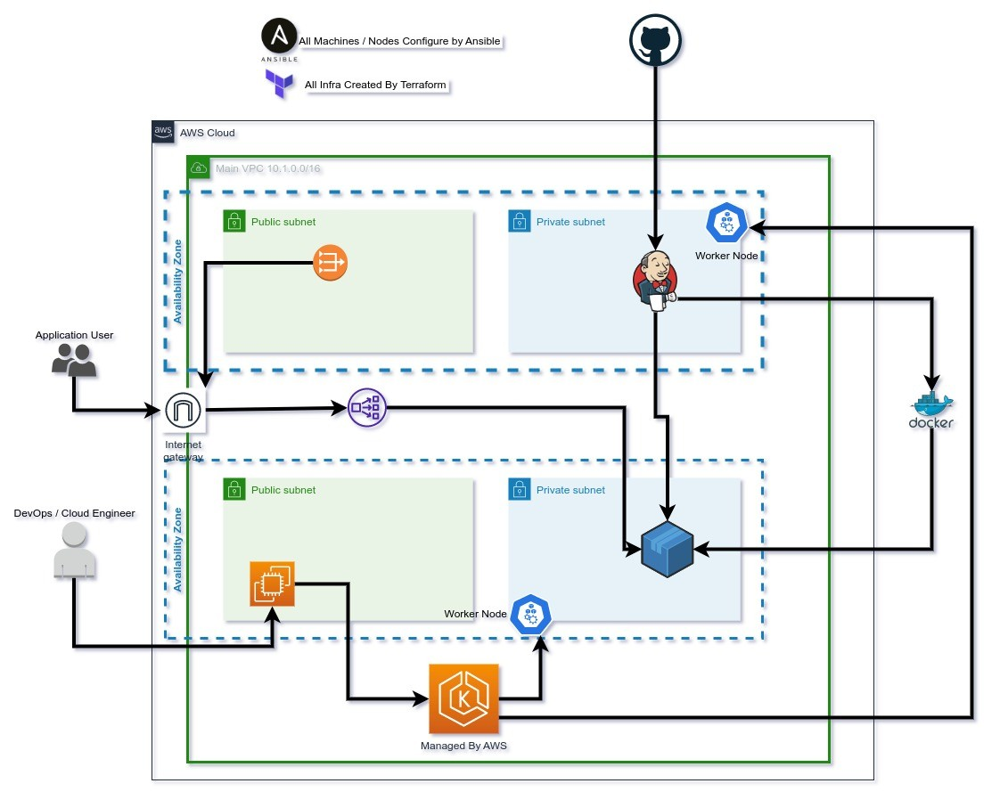

# ITI-Graduation-Project

## Brief

---

### 1. Fully Automated CI/CD Using Jenkins

### 2. Deployed on AWS EKS Cluster

### 3. Configured by Ansible and Terraform

---

## Requirements

Deploy the backend application on a Kubernetes cluster using a CI/CD Jenkins pipeline, using the following steps and high-level diagram:

1. Implement a secure Kubernetes Cluster
2. Deploy and configure Jenkins on Kubernetes
3. Deploy backend application on Kubernetes using Jenkins pipeline

---
## Terraform

Creating full infra :

- Networks: VPC, Subnets, NATs, IGW (4 subnet existed to give the option to create Internal and External LBs)
- EKS Cluster, Node Group
- Jumphost Machine to control the EKS from the inside of the VPC
- <https://github.com/MMamdouh996/ITI-Graduation-Project>

## Ansible

Terraform executes Ansible, which:

- Configures the Node Instances
- Configures Jumphost machine
- Deploys (kubctl) namespaces, ServiceAccount, Role, Role Binding, Jenkins Deployment, Kubernetes service (ELB) to access the Jenkins

## Jenkins

Listens to a specific repo and applies CI/CD to the required App.

- <https://github.com/MMamdouh996/lexalyzer>

## Github Actions

To Dockerize the Jenkins base image and the required packages to be deployed and used on Kubernetes.

- <https://github.com/MMamdouh996/jenkins-image-builder>

---

# Here is the running Process

## 1. Creating Bucket and dynamoDB table to handle tfstate file and lockstate

## 2. Applying of terraform Code

## 3. Terraform provisioning wiht ansible

## 4. IaC finished succesful

## 6. EKS Cluster from Console

## 7. s3 bucket for tfstate

## 8. dynamodb table for lockstate handling

## 9. jumphost instance and worker node

## 10. jenkins loadbalancer

## 11. jenkins start page

## 12. kuberenets status

## 13. configure of jenkins

## 14. jenkins deployed the app succesful

## 15. App load balancer

## 16. the app working well

---

